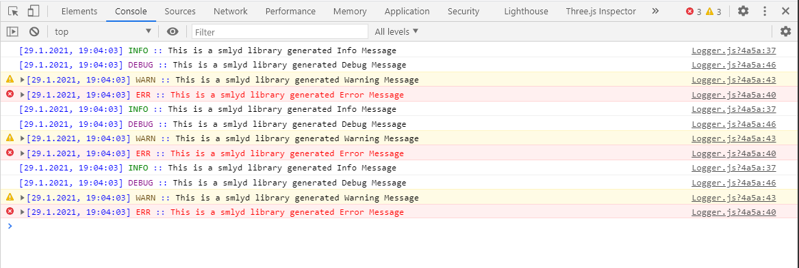

# SMYLD Common Library
is a library that contains some core APIs that helps the SPA developer, this library is a work in progress, it contains the following functionalities so far:

## 1 - Logging API:

logging API facilitates the work on SPA, printing syntax highlighted messages with date and time stamp.

## 2 - Visibility API:

HTML elements can define a special behavior upon being visible in the page. Using these APIs will add a nice affect to the web page design.

