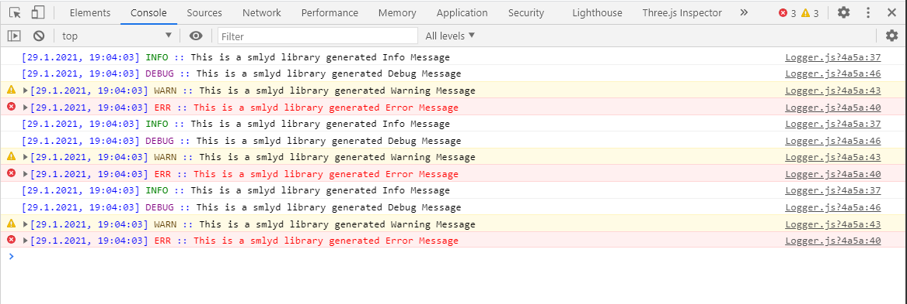

[](https://www.jsdelivr.com/package/npm/smyld-lib-common)
[](https://github.com/MFjamil/smyld-lib-common/blob/master/LICENSE)
[](https://www.npmjs.com/package/smyld-lib-common)
# SMYLD Common Library
is a library that contains some core APIs that helps the SPA developer, this library is a work in progress, it contains the following functionalities so far:


## 1 - Logging API:

The Logging API facilitates the work on Single Page Applications (SPAs) by providing syntax-highlighted messages with date and time stamps. It offers multiple log levels, custom loggers, log caching, and cross-environment support.

### Installation

The library is available on NPM and can be easily installed via the following command:
```npm
npm install smyld-lib-common
```

### Basic Usage

For quick and easy logging, the library provides a pre-configured `MainLogger` instance:

```javascript
import MainLogger from 'smyld-lib-common';

// Basic logging methods
MainLogger.info("This is an info message");
MainLogger.debug("This is a debug message");
MainLogger.warn("This is a warning message");
MainLogger.error("This is an error message");

// Logging objects (with optional compact formatting)
const user = { id: 123, name: "John Doe", role: "Admin" };
MainLogger.info(user);           // Pretty-printed JSON
MainLogger.info(user, true);     // Compact JSON
```

The output of the above code can be seen on the console of the browser as shown below:



### Log Levels

The logger supports multiple log levels to control which messages are displayed:

```javascript
import { LogLevel } from 'smyld-lib-common';

// Available log levels (in order of increasing verbosity)
// LogLevel.OFF     - No logs displayed
// LogLevel.ERROR   - Only errors displayed
// LogLevel.WARN    - Errors and warnings displayed
// LogLevel.INFO    - Errors, warnings, and info displayed (DEFAULT)
// LogLevel.DEBUG   - All logs including debug messages displayed
// LogLevel.ALL     - All logs displayed

// Set log level for MainLogger
MainLogger.logLevel = LogLevel.DEBUG;
```

By default, `MainLogger` uses `LogLevel.DEBUG`, while custom loggers use `LogLevel.DEFAULT` (equivalent to `LogLevel.INFO`).

### Custom Loggers

You can create custom loggers for different components or modules of your application:

```javascript
import { Logger, LogLevel } from 'smyld-lib-common';

// Create a custom logger with a specific source name
const userLogger = new Logger({ 
  source: 'UserService',
  logLevel: LogLevel.INFO
});

userLogger.info('User logged in');
userLogger.debug('Debug info will not show with INFO level');
```

### Log Manager

The `LogManager` allows you to control multiple loggers centrally:

```javascript
import { LogManager, LogLevel } from 'smyld-lib-common';

const logManager = LogManager.getInstance();

// Set log level for all registered loggers
logManager.setGeneralLogLevel(LogLevel.ERROR);

// Set log level for a specific logger
logManager.setLogLevel('UserService', LogLevel.DEBUG);

// Check if a logger exists
if (logManager.hasLogger('UserService')) {
  // Get a reference to an existing logger
  const logger = logManager.getLogger('UserService');
}
```

### Log Caching

The logger can cache log messages, which is useful for debugging or exporting logs:

```javascript
// MainLogger has caching enabled by default
// For custom loggers, enable caching with:
userLogger.setLogSettings({ cacheLogs: true });

// Get cached logs as an array
const logs = MainLogger.getCachedLogs();

// Get cached logs as a Blob (for downloading)
const logsBlob = MainLogger.getCachedLogsAsBlob();
```

### Node.js Support

The library includes a Blob polyfill for Node.js environments, making it fully compatible with both browser and Node.js applications. This allows you to use the same logging code across your entire application stack.

### Vue.js Integration

The library provides a Vue plugin for easy integration with Vue applications:

```javascript
import { createApp } from 'vue';
import { VueLoggerPlugin } from 'smyld-lib-common';
import App from './App.vue';

const app = createApp(App);

// Install the logger plugin with optional settings
app.use(VueLoggerPlugin, {
  cacheLogs: true,
  logLevel: LogLevel.DEBUG
});

app.mount('#app');
```

Once installed, you can access the logger in any component using the `$log` property:

```javascript
// In a Vue component
export default {
  mounted() {
    this.$log.info('Component mounted');
    this.$log.debug('Debug information');
  },
  methods: {
    handleClick() {
      this.$log.info('Button clicked');
    }
  }
}
```

The plugin also provides the logger via Vue's dependency injection system, allowing you to use it in the Composition API:

```javascript
// In a Vue component using Composition API
import { inject } from 'vue';

export default {
  setup() {
    const logger = inject('[log]: router');
    
    logger.info('Component setup');
    
    return {
      logMessage: () => {
        logger.info('Function called');
      }
    };
  }
}
```


## 2 - Visibility API:

HTML elements can define a special behavior upon being visible in the page. Using these APIs will add a nice effect to the web page design.


### Usage
The library can be referenced inside any page as a usual JavaScript library:

```html
<script src='https://cdn.jsdelivr.net/npm/smyld-lib-common@1.0.35/main.min.js'></script>
```

 In your code, you need to define an attribute with the name **shown** inside the **div** element you want to animate when it is visible, this attribute should hold the **css class name(s)** that will be applied to your element once it is visible on the screen.
 
 ```html
  <div id="part1" class="testDiv" style="top:1600px;left:340px;" shown="myCssWhenVisible">One</div>
 ```
 
 Below is a sample of animation applied to the elements once they will be visible in the screen, the animation will take place only **once** in the opened page cycle, if the user would love to review the animation, he can refresh the page. 
 


